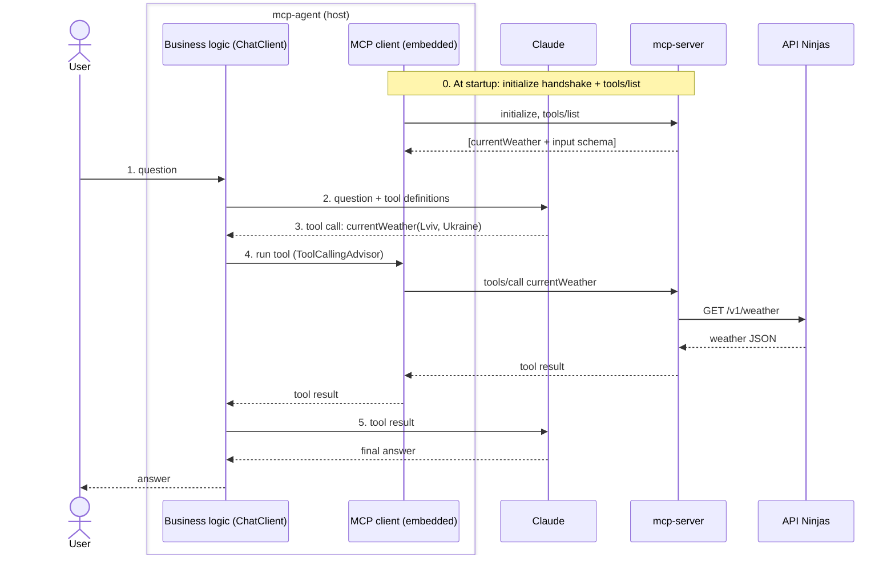

# Spring AI Examples

This repository contains examples of using Spring AI with various AI models and capabilities.

## Prerequisites

- Java 25
- Maven (wrapper included)
- Anthropic API key (Claude) — all chat features
- OpenAI API key — only for image generation (`image`) and text-to-speech (`audio`)
- API Ninjas key — only for `functions`
- Docker — only for the `rag` `prod` profile (Milvus)

## Setup

1. Clone the repository
2. Set your API keys as environment variables:
   ```
   export ANTHROPIC_API_KEY=your_anthropic_key
   export OPENAI_API_KEY=your_openai_key
   export API_NINJAS_API_KEY=your_api_ninjas_key
   ```
3. Build the project:
   ```
   ./mvnw clean install
   ```

## Modules

### Basics

Demonstrates basic usage of Spring AI for text generation.

Features:
- Simple question answering
- Prompt templates (`.st` files with variables)
- Structured output with `ChatClient.entity(...)`: a single record, a richer typed record, and a `List` via `ParameterizedTypeReference`

### Prompt Engineering

Shows advanced prompt engineering techniques with Spring AI.

Features:
- Chain of thought prompting
- Few-shot learning
- System message customization

This module has no endpoints; the examples are JUnit tests (`../mvnw test`).

### RAG (Retrieval Augmented Generation)

Implements Retrieval Augmented Generation for answering questions based on documents.

Features:
- Vector store integration (`SimpleVectorStore` by default, Milvus with the `prod` profile)
- Local ONNX embeddings (`all-MiniLM-L6-v2`) — no embedding API key needed
- Document similarity search
- Context-aware responses

Milvus: `cd rag && docker compose up -d`, then run with `-Dspring-boot.run.profiles=prod`.

### Functions

Demonstrates function calling capabilities with Spring AI.

Features:
- Weather information retrieval
- Function tool callbacks
- Structured data handling

### Image

Shows image generation and understanding capabilities.

Features:
- Image generation with DALL-E 3 (OpenAI)
- Image understanding with Claude

### Audio

Implements text-to-speech generation.

Features:
- Text-to-speech with OpenAI's `gpt-4o-mini-tts`
- Voice customization

### Chat Memory

Multi-turn chat that remembers the conversation, with two memory strategies side by side (`{memoryType}` = `window` or `vector`):

- **window** — `MessageChatMemoryAdvisor` + JDBC-backed `MessageWindowChatMemory`. Every request resends the last 20 messages as chat history; older ones are dropped.
- **vector** — `VectorStoreChatMemoryAdvisor` + PgVector with local ONNX embeddings. Every message is kept forever; each request retrieves only the 6 past messages most similar to the new question and adds them to the system prompt.

Features:
- Per-conversation IDs (required by Spring AI 2.0); `window` IDs are max 36 characters — UUIDs fit
- Streaming responses (Server-Sent Events)
- `SimpleLoggerAdvisor` logs the full request sent to the model — compare the two strategies in the console

PostgreSQL (with pgvector) is started automatically from `chat-memory/docker-compose.yml` by Spring Boot's Docker Compose support when run with `spring-boot:run` (Docker required).

### MCP (Model Context Protocol)

Two modules: `mcp-server` publishes capabilities over MCP (Streamable HTTP on `http://localhost:8090/mcp`), and `mcp-agent` — an agentic chat app — uses them through Claude.

#### Terminology

MCP defines three roles. Only two of them are separate applications here:

| Role | What it is | In this repo |
|---|---|---|
| **Host** | The application the user talks to; it also calls the model. The spec calls it "host" — it is *not* a server. | `mcp-agent` (Claude Code and Claude Desktop are hosts too) |
| **Client** | A connector *inside* the host, one per server. It only speaks MCP and never sees the user's question. | Not a module: Spring AI's `spring-ai-starter-mcp-client` creates it inside `mcp-agent` from `spring.ai.mcp.client.*` properties |
| **Server** | Exposes tools, resources and prompts. | `mcp-server` |

#### What happens on `POST /ask` "What's the weather in Lviv?"



The model never contacts `mcp-server`: it only *asks* the host to call a tool. Claude decides whether and with which arguments, based on the tool's description; the host executes the call.

#### Modules

`mcp-server` (no model, no Anthropic key; needs `API_NINJAS_API_KEY`):
- **Tool** `currentWeather` (`@McpTool`) — chosen by the model; uses `McpSyncRequestContext` to send log notifications back to the client
- **Resources** `movies://titles` and template `movies://{title}` (`@McpResource`) — chosen by the application
- **Prompt** `weather-report` (`@McpPrompt`) — a server-provided prompt template, chosen by the user

`mcp-agent` (start `mcp-server` first):
- Remote MCP tools registered on `ChatClient` like local tools
- Reads a resource and attaches it as context
- Fetches a server prompt and runs it

The server works with any MCP host, e.g. Claude Code:
```
claude mcp add --transport http spring-ai-examples http://localhost:8090/mcp
```

### Agentic Tools

A travel agent over 15 `@Tool` methods (fake, deterministic data — no external APIs), showing Spring AI 2.0's tool-calling features:

- **Tool loop** — `ChatClient` auto-registers `ToolCallingAdvisor`, which keeps calling the model and running requested tools until it answers
- **Tool search** — `ToolSearchToolCallingAdvisor` sends the model a single search tool instead of all 15 definitions; matching tools are revealed on demand (compare token usage with `toolSearch=false|true`)
- **Tool call limits** — `spring.ai.tools.limits.*` caps calls per tool and per request
- **`ToolContext`** — the user id reaches booking tools without ever being shown to the model
- **`StructuredOutputValidationAdvisor`** — validates the model's JSON against the `TripPlan` schema and retries with the errors

Its tests run **without an API key**: a stub model shows that tool search sends 1 tool definition instead of 15, and walks one iteration of the tool loop.

## Usage

Each module can be run independently:

```
cd <module-name>
../mvnw spring-boot:run
```

Then you can interact with the APIs using tools like curl, Postman, or any HTTP client.

## API Examples

### Basics

```
POST /ask
Content-Type: application/json

{
  "question": "What is Spring AI?"
}
```

```
GET /capital?country=France
GET /capital/details?country=France
GET /capitals?region=Scandinavia
```

### RAG

```
POST /ask
Content-Type: application/json

{
  "question": "What is the fuel consumption of the F150 outboard?"
}
```

### Functions

```
POST /weather
Content-Type: application/json

{
  "question": "What is the weather in Lviv, Ukraine?"
}
```

### Image Generation

```
POST /image
Content-Type: application/json

{
  "question": "A beautiful mountain landscape at sunset"
}
```

### Image Understanding

```
POST /vision
Content-Type: multipart/form-data

file=@picture.png
```

### Text-to-Speech

```
POST /audio
Content-Type: application/json

{
  "question": "Hello, this is a test of the text-to-speech functionality."
}
```

### Chat Memory

```
POST /chat/{memoryType}/{conversationId}
Content-Type: application/json

{
  "question": "Hi, my name is Nazar"
}
```

```
POST /chat/{memoryType}/{conversationId}/stream   # same body, streamed as text/event-stream
GET /chat/window/{conversationId}                 # window: the history resent on each request
GET /chat/vector/{conversationId}?query=name      # vector: what would be recalled for this query
DELETE /chat/{memoryType}/{conversationId}        # forget the conversation
```

### MCP Agent

```
POST /ask
Content-Type: application/json

{
  "question": "What's the weather in Lviv, Ukraine?"
}
```

```
POST /movies/Avatar/ask                             # body {"question": "..."}; answered from the movies://Avatar resource
GET /weather-report?city=Lviv&country=Ukraine       # runs the server's weather-report prompt
```

### Agentic Tools

```
POST /ask?toolSearch=true
Content-Type: application/json
X-User-Id: alice

{
  "question": "Find a flight from Kyiv to Lisbon on 2026-10-10 and book the cheapest one"
}
```

```
POST /plan                                          # body {"question": "3 days in Lisbon from 2026-10-10, flying from Kyiv"}; returns a validated TripPlan
```
